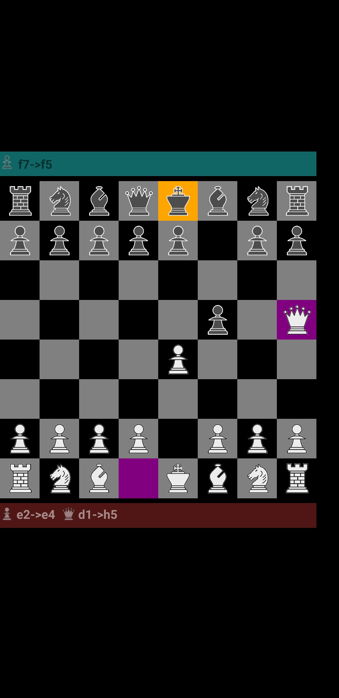

# ChessGameQt
A Chess Game With move validation and GUI Designed by QML,JS And C++

This is a qt-based chess game that has move validation and nice interface for playing offline chess.
It's still under development.
